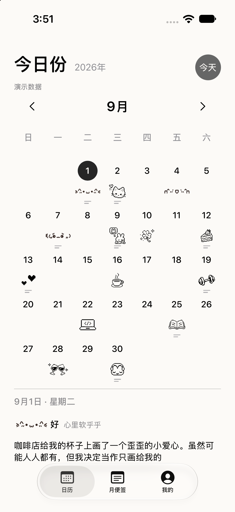
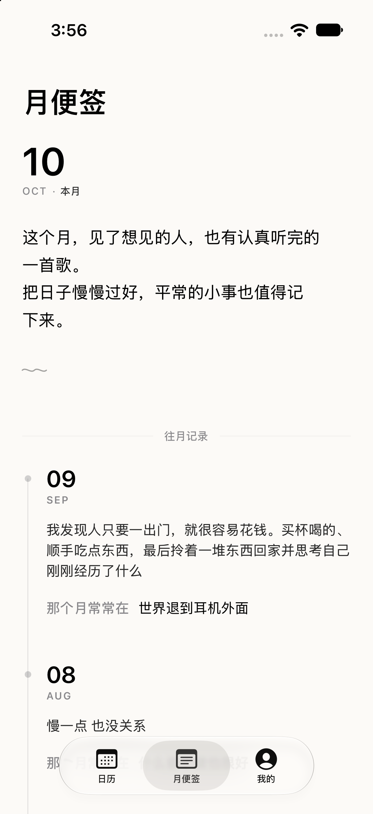

# Mood Calendar

A native iPhone mood calendar built with SwiftUI and SwiftData. You can create or edit one entry for today. Past and future dates can be viewed, but cannot be edited.

The app has three tabs: Calendar, Monthly Note, and Settings. Settings lets you choose an accent color, a date and month selection marker, and a calendar title of up to six characters. The title is a member feature; when left blank, the calendar shows “今日份”. Free users can use the circle and star markers. Other markers require the one-time unlock. Preferences are stored locally. Accent colors do not change the five fixed mood colors, saved entries, or supplied sticker artwork.

## Screenshots

September demo calendar with sample stickers and entries:

Current-month note and previous-month history:

## Features

- The month grid uses fixed-size date cells. The selected date shows its marker; when viewing another date, today's number uses the accent color. The 12-month picker uses the selected marker for the displayed month. Swipe horizontally to change months, tap the year to open the month picker, swipe on the year to change years, or use the arrows to return to today.
- The five supplied mood illustrations are transparent PNGs. Calendar, detail, and editing screens show the full artwork without cropping its sides.
- Days with a text note show two short, light-gray lines beneath the illustration.
- Saving a new selection plays a small entrance animation and an original, gentle paper-sticker sound.
- Five fixed mood levels: Excellent `#F28DB2`, Good `#F3A58F`, Okay `#E8C982`, Bad `#91A9C5`, and Very bad `#A99AB9`.
- Choose one of 30 items in six groups: Mood (`1–5`), Activities (`6–10`), Things to do (`11–15`), Company (`16–20`), Thoughts (`21–25`: electric guitar, wings, cocktail, lighter, and quill), and Rabbits (`26–30`). The picker order is Mood, Things to do, Company, Daily, Thoughts, and Rabbits. Free users can use Mood, Things to do, and Company. The one-time unlock opens all six groups without changing the saved item IDs.
- The selected day's mood detail includes a short phrase for each mood level.
- The app selects today by default. If it stays open past local midnight, returns from the background on a new day, or the device time zone changes, the calendar updates to the new local date. When today has no entry, you can choose a mood from the calendar detail or add a Daily item in the editor. Saved entries can be edited later.
- The editor uses the same warm background as the calendar. All six sticker groups appear together in a two-row grid. VoiceOver announces the selected item and date; date text adapts to larger system text sizes.
- Monthly Note lets you edit a note for the current month, up to 100 characters, and browse every month with a saved entry or note. Each month also shows its most frequent saved item; ties go to the item recorded last.
- Past dates show the saved mood and note, or an appropriate empty-state message. Future dates show that the day has not arrived yet.
- Daily entries and monthly notes are stored on-device with SwiftData. iCloud sync can be enabled in Settings and uses the user's private CloudKit database when available.
- Export daily entries and monthly notes to `今日份.zip`. The archive contains `manifest.json` (format version and export time) and `data.json`. Export is supported; import may be added later.
- Settings can enable iCloud sync. After changing the setting, fully quit and reopen the app. CloudKit syncs local entries and notes when the user is signed in to iCloud and sync is available. Turning sync off stops future syncing but does not delete existing cloud copies. The developer must configure the `iCloud.com.qingqing.MoodCalendar` container for `com.qingqing.MoodCalendar` in the Apple Developer account.
- Debug builds include previews for “signed in, sync off” and “sync on” states. These previews only change what the screen shows; they do not enable CloudKit or alter the real sync setting.
- The app requests notification permission on the first visit to Calendar and schedules a daily reminder while today has no entry. You can turn reminders off or on in Settings. Turning them off cancels pending reminders. If system notifications are denied, Settings offers a shortcut to iPhone Settings. The Debug demo also supports testing reminder controls.
- A one-time permanent unlock is available through StoreKit 2, with purchase validation and Restore Purchases. Free access includes the Cherry Blossom and Black themes, circle and star markers, and the Mood, Things to do, and Company sticker groups. The calendar title and other themes, markers, and groups require the unlock. App Store Connect must have the non-consumable product `com.qingqing.MoodCalendar.permanentUnlock` priced at CNY ¥12; without it, purchase is unavailable.

## Run

1. Install the full version of Xcode (the deployment target is iOS 17 or later).
2. Open `MoodCalendar.xcodeproj`.
3. Choose a scheme and iPhone simulator, then click Run.

- `MoodCalendar`: normal build with persistent local storage and no sample entries.
- `MoodCalendar Demo`: Debug-only sample data in an isolated in-memory store. It includes five June entries, six August entries, fourteen September entries, monthly notes for August and September, a sample note for the current month, and a February 2022 entry and note for testing older history. It does not write to the normal store and does not support iCloud or App Store purchases.

The bundle ID is `com.qingqing.MoodCalendar`; the CloudKit container is `iCloud.com.qingqing.MoodCalendar`. Device sync requires the Apple Developer team to enable the container and use a provisioning profile with the iCloud entitlement.

## Code layout

- `App`: app startup and SwiftData container setup.
- `Features/Calendar`: calendar screen, fixed-size date cells, and selected-date details.
- `Features/Monthly`: current monthly note and historical summaries.
- `Features/Settings`: theme color, selection marker, and permanent unlock screens.
- `Features/Theme`: theme palettes, marker choices, and accent colors.
- `Features/Entry`: today's entry editor.
- `Domain`: mood levels, daily choices, calendar days, and month layout.
- `Persistence`: SwiftData models, migration, and write operations for entries and monthly notes.
- `Persistence/DataBackup.swift`: ZIP backup generation with a manifest and JSON data.
- `App/DemoData.swift`: sample records for the Debug demo scheme only.
- `App/MembershipStore.swift`: StoreKit 2 purchase validation and entitlement restoration.
- `PrivacyInfo.xcprivacy`: declares that the app does not track or collect data and explains its use of UserDefaults for app settings.

Calendar days are stored as the local year, month, and day when the entry is created, such as `2026-10-04`. The entry stays on that calendar date when viewed from another time zone. See `AGENTS.md` for development conventions.

---

# 心情日历

一款原生 iPhone 心情日历。今天可以保存或修改一条记录；过去和未来的日期可以点选查看，但不能补记或提前记录。

底部有「日历」「月便签」和「我的」三个页面。「我的」可从八种主题色（含黑色）中选择界面强调色、在六种日期和月份选中图形之间切换，也可设置最多六个字的日历标题；标题留空时显示「今日份」。日历标题属于会员功能。免费用户可使用圆形和星星，图形列表中星星紧跟在圆形之后；其他图形需永久解锁。这些设置保存在本机，下次打开仍然生效。主题色只改变界面强调元素，不改变五档心情的固定颜色、已保存记录或表情原画。

## 第一版功能

- 月历用固定大小的日期格显示当天选的图案；只有选中的日期显示所选图形，查看其他日期时今天的数字显示主题色。12 个月选择界面也只用所选图形标记正在查看的月份。可左右滑动月历切换月份；点年份打开月份选择界面，在年份处左右滑动切换年份，也可用箭头切换并返回今天。
- 使用新提供的五张表情图片；资源均为同尺寸透明 PNG，日历、详情和编辑页会完整显示表情，不裁掉左右笔画。
- 有文字记录的日期会在表情下方显示两道浅灰色短线。
- 成功保存新选择时，日期格会播放出现动画，并搭配一段轻柔的原创纸质贴纸轻贴提示。
- 五档心情：极好 `#F28DB2`、好 `#F3A58F`、一般 `#E8C982`、不好 `#91A9C5`、很差 `#A99AB9`。
- 每天从六组共三十项中选择一项：「心情」五项（编号 `1–5`）、「日常」五项（`6–10`）、「做点事」五项（`11–15`）、「陪伴」五项（`16–20`）、「心思」五项（`21–25`：电吉他、翅膀、鸡尾酒、打火机、羽毛笔）和「兔兔」五项（`26–30`：星星兔、眼镜兔、委屈兔、笑晕兔无语兔）。选择页顺序为「心情」「做点事」「陪伴」「日常」「心思」「兔兔」。新图为 1024×512 透明 PNG，尺寸和留白对齐现有表情。免费用户可用「心情」「做点事」和「陪伴」；永久解锁后可使用全部六组，原有编号保持不变。
- 所选日期的心情详情会在等级名称旁显示对应短句：幸福到融化、心里软乎乎、今天就这样、小小不开心或快要碎掉了。
- 默认选中今天；若 App 跨过当地午夜后仍在前台，或第二天从后台打开，会自动切到新的一天。手机时区变化时也会按新的当地日期重新显示日历并校准午夜定时器。若尚未记录，可从首页详情区直接选心情，或进入编辑页选「日常」；记录后可打开编辑页修改所选项目或文字。
- 编辑页使用与首页一致的暖色背景；六个表情分组以两行三列同时显示，所选项目会高亮，并向 VoiceOver 说明选中状态。日历日期也会朗读选中状态，日期文字随系统字号适度放大。
- 「月便签」显示本月可编辑的一句话，并列出所有有记录或便签的历史月份，不受最近 12 个月限制；每个月根据保存的选项显示最常出现的内容。六组项目参与同一计算，次数相同时取最后出现的项目。
- 点选过去的日期可在日历下方查看心情和文字；没有文字或没有记录时显示对应提示。点选未来日期会显示“这一天还没到来”。
- 每日记录和月便签使用 SwiftData 保存在设备本地；用户可在「我的」开启 iCloud 同步，在登录 iCloud 且容器可用时同步到私有 CloudKit 数据库。
- 「我的」可将每日记录和月便签导出为「今日份.zip」。压缩包包含 `manifest.json`（备份格式版本和导出时间）及 `data.json`（记录数据）；目前只支持导出，文件中的文字可直接读取，导入功能可在以后基于格式版本实现。
- 「我的」可开启 iCloud 同步。启用后需完全退出并重新打开 App；CloudKit 会在用户登录 iCloud 且同步可用时自动同步本地每日记录和月便签。关闭开关只停止后续同步，不会删除云端已有副本。开发者需在 Apple Developer 账号中为 `com.qingqing.MoodCalendar` 配置 `iCloud.com.qingqing.MoodCalendar` CloudKit 容器。
- Debug 构建提供“预览已登录、未开启”和“预览已开启”入口，只用于查看界面，不会开启 CloudKit 同步或更改实际同步设置。
- 首次进入日历时，App 会请求通知权限，并为尚未记录的日期安排每日提醒。「我的」中可关闭或重新开启提醒；关闭会撤销尚未发送的提醒。系统通知被拒绝时，「我的」会提供打开 iPhone 设置的入口。Debug 演示模式也可测试提醒开关和通知。
- 「我的」提供一次性永久解锁：免费状态可使用樱粉和黑色主题、圆形与星星选中图形、「心情」「做点事」和「陪伴」三组表情；日历标题及其余表情组、主题色和选中图形需购买解锁。购买通过 StoreKit 2 校验，并支持恢复购买。App Store Connect 需创建非消耗型商品 `com.qingqing.MoodCalendar.permanentUnlock` 并设为人民币 ¥12；未配置商品前，购买按钮不可用。

## 运行

1. 在 Mac 上安装完整的 Xcode（项目目标为 iOS 17 或更新版本）。
2. 打开 `MoodCalendar.xcodeproj`。
3. 在顶部选择运行方案和一款 iPhone 模拟器，点击运行按钮。

- `MoodCalendar`：正式本地数据，没有示例记录。
- `MoodCalendar Demo`：Debug 演示数据，包含本年 6 月 5 条、8 月 6 条、9 月 14 条记录，以及 8 月、9 月和本月的便签；另有 2022 年 2 月 14 日的记录和当月便签，用于检查跨年历史。记录使用独立的内存存储，不会写入正式记录，也不支持 iCloud 或 App Store 购买。

项目当前使用 bundle ID `com.qingqing.MoodCalendar`，CloudKit 容器标识为 `iCloud.com.qingqing.MoodCalendar`。真机同步需要对应 Apple Developer 团队启用该 CloudKit 容器，并使用包含 iCloud 权限的 provisioning profile。

## 代码结构

- `App`：启动和注入 SwiftData 容器。
- `Features/Calendar`：月历页面、固定大小的日期格和选中日期详情。
- `Features/Monthly`：本月便签与历史月份的小结。
- `Features/Settings`：主题色、选中图形和永久解锁页面。
- `Features/Theme`：主题色、选中图形及界面强调色定义。
- `Features/Entry`：今天的记录编辑页。
- `Domain`：心情等级、每日选项、日历日和月份排列。
- `Persistence`：每日记录与月便签的 SwiftData 模型、迁移和写入操作。
- `Persistence/DataBackup.swift`：生成带格式清单和 JSON 数据的 ZIP 备份文件。
- `App/DemoData.swift`：仅在 Debug 演示方案中生成过去的示例记录。
- `App/MembershipStore.swift`：使用 StoreKit 2 校验永久解锁购买和恢复权益。
- `PrivacyInfo.xcprivacy`：声明不追踪或收集数据，并说明仅使用 UserDefaults 保存本 App 的设置。

日历日以用户记录时的本地年月日保存，例如 `2026-10-04`。以后跨时区查看时，这条记录仍显示在原来的日历日。开发约定见 `AGENTS.md`。
